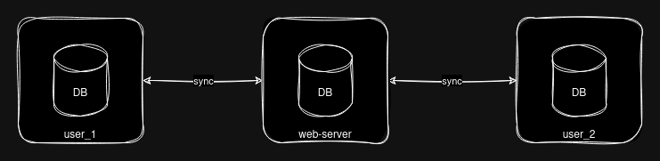

# cr-sqlite sample

https://github.com/vlcn-io/cr-sqlite

```sh

# first unzip compressed crsqlite binary into ./crsqlite
# e.g. ./crsqlite/crsqlite.so

# run end-to-end test
pytest todo_sync_test.py

```

- storage of common TodoLists with TodoItems of 2 different users in local sqlite DBs
- change tracking via crsqlite
- sync protocol (pull of all foreign changes, push of all own changes)
- network layer and synchronization via web-server

users can concurrently store data independently,
changes are pulled/pushed upon sync,
and conflicting changes are merged automatically by crsqlite


